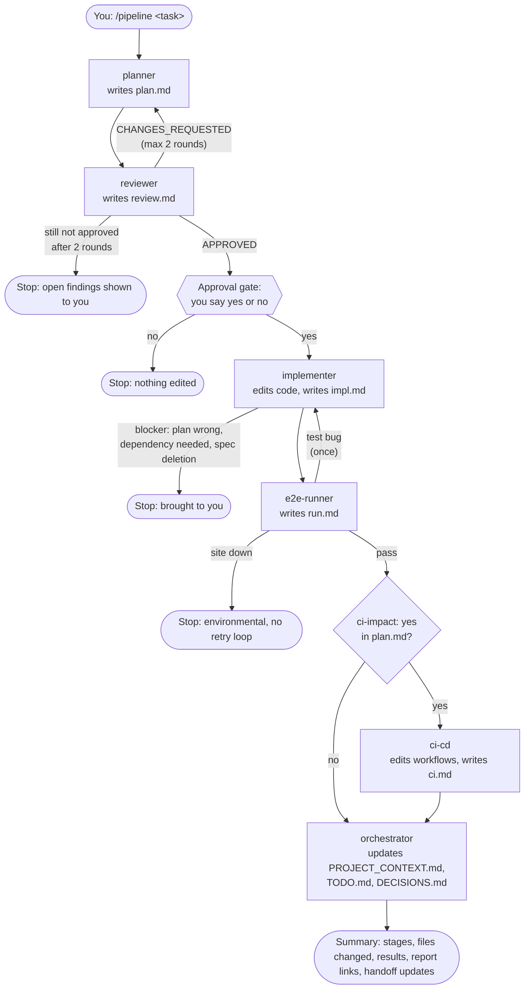

# Agentic Playwright Framework

An end-to-end test suite for the public [OrangeHRM demo](https://opensource-demo.orangehrmlive.com), built with **Playwright + TypeScript**. Features are developed spec-first with **GitHub Spec Kit** and delivered through a set of **Claude Code subagents** (plan → review → implement → run → CI).

The repository contains tests only. The application under test is the hosted OrangeHRM demo.

---

## Contents

- [Tech stack](#tech-stack)
- [Architecture](#architecture)
- [Project layout](#project-layout)
- [Getting started](#getting-started)
- [Running tests](#running-tests)
- [Reports](#reports)
- [Test data and cleanup](#test-data-and-cleanup)
- [Continuous integration](#continuous-integration)
- [Spec-driven development with Spec Kit](#spec-driven-development-with-spec-kit)
- [Agent workflow (Claude Code)](#agent-workflow-claude-code)
- [Project memory: AGENTS.md and the handoff files](#project-memory-agentsmd-and-the-handoff-files)
- [Conventions](#conventions)
- [Troubleshooting](#troubleshooting)

---

## Tech stack

| Area | Choice | Notes |
|---|---|---|
| Test runner | [`@playwright/test`](https://playwright.dev) ^1.55 (1.63 installed) | Chromium project only |
| Language | TypeScript ^5.6, `strict` | `tsc --noEmit` is the static check; there's no linter |
| Runtime | Node.js **20.19+** or 22.12+ | Required by faker v10 (see below) |
| Package manager | npm | `package-lock.json` is committed |
| Test data | [`@faker-js/faker`](https://fakerjs.dev) ^10.6 | ESM-only; loaded from CommonJS through Node's `require(esm)` |
| Config | `dotenv` | Optional `.env`. Defaults target the public demo. |
| Reporting | Playwright HTML + JSON, [Allure 3](https://allurereport.org) (`allure-playwright` + `allure` CLI) | Allure 3 is Node-based, so no Java is needed |
| CI | GitHub Actions, `ubuntu-latest`, headless | `.github/workflows/playwright.yml` |
| Spec workflow | [GitHub Spec Kit](https://github.com/github/spec-kit) (`specify` CLI 1.0.x) | Skills in `.claude/skills/speckit-*` |
| Agents | Claude Code subagents + a `/pipeline` command | `.claude/agents/`, `.claude/commands/` |

---

## Architecture

The tests are organised in layers. Specs never touch selectors or HTTP directly.

```
tests/e2e/**/*.spec.ts           what is tested (scenarios, assertions)
        │  import { test, expect } from fixtures
        ▼
tests/fixtures/pages.fixture.ts  wiring: page objects, login session, generated data, teardown
        │
        ├──▶ tests/pages/*.page.ts     page objects (locators + page actions), all extend BasePage
        ├──▶ tests/api/orangehrm.api.ts REST helpers for setup/cleanup, using the logged-in page.request
        ├──▶ tests/data/*.factory.ts   faker builders for form data
        └──▶ tests/utils/              env (BASE_URL, ROUTES, API_BASE), fixed strings, helpers
```

**Fixtures do more than construct objects; some have side effects:**

| Fixture | What it gives the test | Side effects |
|---|---|---|
| `loginPage` | `LoginPage` | Navigates to the login page and waits for the form |
| `dashboardPage` | `DashboardPage` | None |
| `loggedInDashboard` | `DashboardPage` | Logs in through the UI as the admin |
| `addUserPage`, `systemUsersPage` | Page objects | None (call `goto()` yourself) |
| `testEmployee` | `{ firstName, lastName, empNumber, displayName }` | Creates an employee through the API. **Deletes it after the test.** |
| `newUser` | `(role) => { role, status, username, password }` | Generates credentials. **Deletes any user saved with them after the test.** |

**Why the setup and the thing under test use different routes:** in `add-user.spec.ts`, the precondition employee is created through the REST API, because that's fast and the employee is not what's being tested. The **user** is created through the real Add User form, because that's the feature under test.

**The target site shapes the configuration.** The public demo is shared, slow and sometimes unreachable, so `playwright.config.ts` uses:
- long timeouts: 180s per test, 120s per navigation, 30s per `expect`;
- `workers: 1`;
- 1 local retry, or 2 in CI.

`BasePage.navigate` waits only for `domcontentloaded`, and slow tests call `test.slow()` instead of raising the global timeout.

---

## Project layout

```
.
├── .github/workflows/playwright.yml   CI: every trigger runs the full suite, headless
├── .claude/
│   ├── agents/                        planner, reviewer, implementer, e2e-runner, ci-cd
│   ├── commands/pipeline.md           /pipeline orchestrator
│   └── skills/speckit-*/              Spec Kit skills (/speckit-specify, /speckit-plan, …)
├── .specify/                          Spec Kit templates, scripts, memory (constitution)
├── specs/
│   └── 001-add-admin-ess-users/       spec, plan, research, data model, contracts, quickstart, tasks
├── tests/
│   ├── api/                           REST helpers (setup & cleanup)
│   ├── data/                          faker builders
│   ├── e2e/
│   │   ├── auth/                      login.spec.ts, logout.spec.ts
│   │   └── admin/                     add-user.spec.ts
│   ├── fixtures/                      pages.fixture.ts
│   ├── pages/                         page objects
│   └── utils/                         env, test-data, helpers
├── AGENTS.md                          working loop for any coding agent (read → work → update)
├── CLAUDE.md                          team rules and repo notes (read this before contributing)
├── PROJECT_CONTEXT.md                 current project state
├── TODO.md                            next steps and known problems
├── DECISIONS.md                       numbered decisions (D1…) and their reasons
├── playwright.config.ts
└── tsconfig.json
```

---

## Getting started

### Prerequisites
- **Node.js 20.19+** (or 22.12+). Older Node 20 releases can't load faker v10.
- Git.
- Optional: Python 3.11+ for the Spec Kit CLI, and [Claude Code](https://claude.com/claude-code) for the agent workflow.

### Install

```bash
git clone https://github.com/Vijay-puppala/agentic-playwright-framework.git
cd agentic-playwright-framework
npm ci
npx playwright install --with-deps chromium
```

### Configure (optional)

Everything defaults to the public demo and its published credentials. To point at another OrangeHRM instance:

```bash
cp .env.example .env
```

| Variable | Default |
|---|---|
| `BASE_URL` | `https://opensource-demo.orangehrmlive.com` |
| `ADMIN_USERNAME` | `Admin` |
| `ADMIN_PASSWORD` | `admin123` |

### Check that everything works

```bash
npm run typecheck
npm run test:smoke
```

---

## Running tests

| Command | What it does |
|---|---|
| `npm test` | All tests |
| `npm run test:smoke` | Tests tagged `@smoke` |
| `npx playwright test tests/e2e/admin/add-user.spec.ts` | One file |
| `npx playwright test -g "Admin role"` | Tests whose title matches |
| `npm run test:headed` | With a visible browser |
| `npm run test:ui` | Playwright UI mode (interactive) |
| `npm run test:debug` | Step through with the inspector |
| `npm run codegen` | Record locators against the demo |
| `npm run typecheck` | TypeScript check |

**Tags** go in the test title and are selected with `--grep`: `@smoke`, `@critical`, `@regression` (also reserved: `@flaky`, `@wip`).

> **Don't pass `--reporter` on the command line.** It replaces the reporters in the config, and then neither the HTML report nor `allure-results/` get written.

---

## Reports

| Report | Build | Open |
|---|---|---|
| Playwright HTML | written automatically to `playwright-report/` | `npm run report` |
| JSON | written automatically to `test-results/results.json` | n/a |
| Allure 3 | `npm run allure:generate` (reads `allure-results/`) | `npm run allure:open` |

`allure-results/` accumulates across runs. Delete it before a run to get a report of just that run.

Failures keep a screenshot and video. A trace is recorded on the first retry.

---

## Test data and cleanup

- **All form data is generated** with faker in `tests/data/user.factory.ts`:
  - names are letters only, plus a unique suffix;
  - usernames are lower-case alphanumeric, plus a unique suffix;
  - passwords are 12 characters and always include an upper-case letter, a lower-case letter and a digit.

  Nothing personal is hard-coded.
- **Generated values are attached to each test** as `generated-employee` and `generated-user` (JSON). The employee's data is attached *before* it's created, so even a failure during setup shows what data it used.
- **Tests clean up after themselves.** The demo is shared, so fixture teardown deletes every user and employee a test created, whether the test passed or failed. Records that are already gone are ignored. Any other cleanup error becomes a `cleanup-warning` annotation in the report, and never replaces the test's real result.
- **To check that a failed test still cleans up**, set `FORCE_FAIL_BEFORE_SAVE=1` to make `add-user.spec.ts` fail straight after generating its data:

  ```bash
  FORCE_FAIL_BEFORE_SAVE=1 npx playwright test tests/e2e/admin/add-user.spec.ts --retries=0
  ```

---

## Continuous integration

`.github/workflows/playwright.yml` runs on **pull requests**, **pushes to `main`** and **manual dispatch**. Every trigger runs **every test, whatever its tags**, on `ubuntu-latest`, headless.

Steps:
1. Node 20 with the npm cache, then `npm ci`.
2. `npx playwright install --with-deps chromium`.
3. `npm run typecheck`.
4. `npx playwright test --project=chromium`. `CI=true` gives 2 retries, `forbidOnly` (a stray `test.only` fails the run) and the GitHub annotations reporter.
5. `npm run allure:generate`.
6. Upload `playwright-report/`, `allure-report/` and `test-results/` as the artifact `playwright-reports-<run id>`, kept for 14 days, even when tests fail.

A newer push to the same branch cancels any run still in progress. Each job is limited to 60 minutes.

The workflow reads no secrets, so the public demo defaults apply. An unset GitHub secret arrives as an empty string, and `tests/utils/env.ts` falls back to the defaults only with `??` (a missing value, not an empty one). Change those to `||` before wiring in `ADMIN_*` secrets.

---

## Spec-driven development with Spec Kit

New features start as a specification, not as code. [Spec Kit](https://github.com/github/spec-kit) provides the templates, scripts and the Claude Code skills that drive each step.

### One-time setup (optional)

Only needed to re-initialise or upgrade Spec Kit; the scaffold is already committed.

```bash
pip install --user git+https://github.com/github/spec-kit.git   # or: uv tool install specify-cli --from git+https://github.com/github/spec-kit.git
specify init --here --force --integration claude
```

### The flow

Run these in Claude Code, in order:

| Step | Command | Output (in `specs/NNN-<feature>/`) |
|---|---|---|
| 0. Principles *(optional, once)* | `/speckit-constitution` | `.specify/memory/constitution.md` |
| 1. Specify | `/speckit-specify <what you want>` | `spec.md`, `checklists/requirements.md` |
| 2. Clarify *(optional)* | `/speckit-clarify` | answers written back into `spec.md` |
| 3. Plan | `/speckit-plan` | `plan.md`, `research.md`, `data-model.md`, `contracts/`, `quickstart.md` |
| 4. Tasks | `/speckit-tasks` | `tasks.md` (grouped by user story, `[P]` marks tasks that can run in parallel) |
| 5. Analyze *(recommended)* | `/speckit-analyze` | read-only report checking the spec, plan and tasks against each other |
| 6. Implement | `/speckit-implement` | code, with each task ticked `[X]` in `tasks.md` |

Features are numbered in sequence (`001-…`, `002-…`). `.specify/feature.json` records the active feature. It's local state and is git-ignored.

**Worked example:** `specs/001-add-admin-ess-users/` is a complete feature, taken from spec to implementation and validated with 20 passing runs and no leftover data. Read `research.md` for how the plan was grounded in probes of the live site.

**Constitution:** `.specify/memory/constitution.md` is still the blank template. Until it's filled in, plans check themselves against the rules in `CLAUDE.md`. Running `/speckit-constitution` with those rules is a good first step.

---

## Agent workflow (Claude Code)

Delivery is split across **five specialised subagents**, each defined in `.claude/agents/<name>.md` with its own model, tool allow-list and rules. Keeping planning, reviewing, coding, testing and CI in separate agents means each one works with a small context, can only use the tools its job needs (the reviewer can't edit code, and the runner can't change tests), and leaves a written record of what it decided.

### Why there's an orchestrator command

In Claude Code, **subagents can't start other subagents**. So the "main agent" is your own Claude Code session running the `/pipeline` command (`.claude/commands/pipeline.md`). It calls each subagent in turn and reads what it wrote. It doesn't plan, write code or run tests itself: it only coordinates.

Each subagent **starts with no memory** of your conversation. Everything it knows comes from the prompt the orchestrator gives it and from the **handoff files** in `.work/<task-slug>/`, which is git-ignored. These files are both the interface between agents and an audit trail you can read.

### The flow



**Gates and loops, in order:**

1. **Review loop.** If the reviewer returns `CHANGES_REQUESTED`, the planner revises the plan against `review.md` and it's reviewed again. After 2 rounds without approval, the pipeline stops and shows you the open findings.
2. **Human approval gate.** Nothing is edited before this point. The orchestrator shows you:
   - the plan's goal and changes;
   - its three flags (`config-change`, `deps-change`, `ci-impact`);
   - any review findings.

   It then asks whether to implement. If `deps-change: yes`, it reminds you that dependency bumps go in their own PR (CLAUDE.md §9).
3. **Implementation blockers.** If the plan turns out to be wrong, a dependency is needed, or a spec would have to be deleted, the implementer stops and reports instead of improvising.
4. **Test-bug loop (one retry).** If the e2e-runner reports a real test bug, the implementer gets one chance to fix only that, and the tests run again. A second failure stops the pipeline.
5. **Site-down stop.** If the demo is unreachable, the pipeline stops and reports it as environmental. It never loops against a dead site.
6. **CI only when needed.** `ci-cd` runs only when `plan.md` says `ci-impact: yes`.
7. **Project memory updated.** Whenever the pipeline got as far as the implementer (including an early stop), the orchestrator updates `PROJECT_CONTEXT.md`, adds new problems and blockers to `TODO.md`, and checks that the plan's decisions were recorded in `DECISIONS.md`. See [Project memory](#project-memory-agentsmd-and-the-handoff-files).

The pipeline **never commits or pushes**. You do that afterwards (CLAUDE.md §8: Conventional Commits, no co-author trailers).

### The agents in detail

#### 1. `planner`: decides *what* to change

| | |
|---|---|
| **Model / tools** | Opus. Read, Grep, Glob, Bash (read-only commands only), Write (only `plan.md`) |
| **Reads** | `CLAUDE.md`, `PROJECT_CONTEXT.md`, `DECISIONS.md`, `TODO.md`, recent `git log`, the code the task touches, existing fixtures (`tests/fixtures/pages.fixture.ts`), page objects (`tests/pages/`), API helpers (`tests/api/`), faker builders (`tests/data/`) and utilities (`tests/utils/`) |
| **Writes** | `.work/<slug>/plan.md` |
| **Must** | Reuse existing fixtures and page objects before proposing new ones. Plan against the repo as it actually is (see CLAUDE.md §10). Put each flag on its own line: `config-change: yes/no`, `deps-change: yes/no`, `ci-impact: yes/no`. |
| **Never** | Edits source, config or dependencies. Plans a dependency bump into the same change. |
| **On revision** | If `review.md` exists, it addresses every numbered finding and says how. |

`plan.md` sections: **Goal**, **Changes** (file → what and why, naming the helpers reused), **Tests** (spec, title, tags, assertions), **Impacted specs to run**, **Decisions** (new or superseded `D<n>` entries, with reasons), **TODO updates**, and **Risks / open questions**. A plan that goes against a recorded decision must propose a new one here.

#### 2. `reviewer`: checks the plan before any code exists

| | |
|---|---|
| **Model / tools** | Opus. Read, Grep, Glob, Write (only `review.md`). **No Bash, no Edit.** |
| **Reads** | `CLAUDE.md`, `DECISIONS.md`, `TODO.md`, `PROJECT_CONTEXT.md`, `plan.md`, and the files the plan names |
| **Writes** | `.work/<slug>/review.md`, with `verdict: APPROVED` or `verdict: CHANGES_REQUESTED`, followed by numbered findings, each tagged `[blocking]` or `[minor]` |
| **Checks** | **Reuse** of existing code. The **rules**: locators §3, waits §4, data §5, tags §6. **Accuracy of the flags**; a config change needs a reason. **Correctness**, including fixture side effects: requesting `loginPage` navigates first. **Completeness**: the impacted specs are listed. **Decisions**: contradicting a `DECISIONS.md` entry without proposing a new one is blocking. **Test data**: anything created on the demo is deleted in fixture teardown. |
| **Principle** | `CHANGES_REQUESTED` only for blocking findings; minor ones can go through with `APPROVED`. It doesn't invent issues, and an empty findings list is fine. |
| **Standalone mode** | Given file paths or a diff, it reviews that code for rule violations and correctness bugs. |

#### 3. `implementer`: makes exactly the approved change

| | |
|---|---|
| **Model / tools** | Sonnet. Read, Edit, Write, Grep, Glob, Bash |
| **Reads** | `CLAUDE.md`, the three handoff files, `plan.md`, `review.md` (proceeds only if `APPROVED`), and `run.md` in a fix round |
| **Writes** | Code, plus `.work/<slug>/impl.md`: files changed, verification results (typecheck, each spec), and any deviations from the plan. Also appends the plan's decisions to `DECISIONS.md` and ticks off or adds items in `TODO.md` (`PROJECT_CONTEXT.md` is the orchestrator's, unless the implementer is called directly). |
| **Must** | Match the existing code: specs import from the fixtures, page objects extend `BasePage`, routes come from `ROUTES`. Run `npm run typecheck` and every impacted spec after editing. Use role, label, placeholder or text locators first; a CSS class only with a `// why` comment. |
| **Never** | Uses `waitForTimeout` or XPath. Edits `playwright.config.ts` unless the plan says `config-change: yes`. Adds or bumps dependencies. Deletes a spec. Commits. |
| **Site-down awareness** | Reports `ERR_TIMED_OUT` / `ERR_CONNECTION_CLOSED` as environmental, and doesn't "fix" them with longer timeouts. |

#### 4. `e2e-runner`: runs the tests and sorts out the failures

| | |
|---|---|
| **Model / tools** | Sonnet. Bash, Read, Grep, Glob, Write (only `run.md`). **Never edits code.** |
| **Reads** | `TODO.md` known problems and `PROJECT_CONTEXT.md` verified results (to tell known issues from new ones), then "Impacted specs to run" in `plan.md` (pipeline mode), or whatever scope you ask for |
| **Writes** | `.work/<slug>/run.md`: site status, pass/fail/flaky counts, a per-test table with the triage of each failure, **New problems** (not already in `TODO.md`, including any `cleanup-warning`), and the report paths. It doesn't edit the handoff files; the orchestrator records its new problems. |
| **Steps** | 1. `curl` the login page; if it isn't HTTP 200, stop with "site down". 2. Pick the scope. 3. Clear `allure-results/`. 4. Run `npx playwright test <scope> --project=chromium` (**never** with `--reporter`). 5. `npm run allure:generate`. 6. Triage every failure from `test-results/*/error-context.md`. 7. Look for `cleanup-warning` annotations in `test-results/results.json`. |
| **Triage** | **site-down**: network errors in `page.goto`, or the Login button never appears. **flaky**: passed on retry. **test bug**: anything else, with the error and the failing line quoted. |

#### 5. `ci-cd`: maintains the GitHub Actions workflow

| | |
|---|---|
| **Model / tools** | Sonnet. Read, Edit, Write, Grep, Glob, Bash |
| **Reads** | `CLAUDE.md` (§6, §7, §10), `DECISIONS.md` (D11, D12), `TODO.md`, `playwright.config.ts`, `package.json`, and in pipeline mode `plan.md` and `run.md` |
| **Writes** | `.github/workflows/*.yml`, plus `.work/<slug>/ci.md` (jobs, triggers, secrets, validation result). Records CI decisions in `DECISIONS.md` and updates CI items in `TODO.md`. |
| **Rules** | `ubuntu-latest`, headless, Node 20, `npm ci`, `npx playwright install --with-deps chromium`. **Every trigger runs the full suite; no tag filters.** `CI: true`. Reports uploaded with `if: !cancelled()`. Actions pinned to major versions. **No `ADMIN_*` secrets** (see [Continuous integration](#continuous-integration)). |
| **Never** | Edits tests or `playwright.config.ts` (config needs go back through the planner). Adds dependencies. Commits or pushes. |
| **Validates** | Parses every workflow with `yaml`, and runs `actionlint` if it's installed. |

### Handoff files at a glance

```
.work/<task-slug>/
├── plan.md     planner      → reviewer, implementer, e2e-runner, ci-cd
├── review.md   reviewer     → planner (revision), implementer (approval + minor findings)
├── impl.md     implementer  → you (summary), e2e-runner
├── run.md      e2e-runner   → implementer (fix round), ci-cd, you (summary)
└── ci.md       ci-cd        → you (summary)
```

### Using it

```text
/pipeline <task>                                  # full flow: plan → review → approval → implement → run → CI if needed
/pipeline <task> --only reviewer                  # one stage only, with no loops and no approval gate
/pipeline <task> --from implementer               # resume; the earlier handoff files must already exist in .work/<slug>/
```

Every agent can also be called **directly**, outside the pipeline:

```text
@agent-e2e-runner run smoke
@agent-e2e-runner run tests/e2e/admin/add-user.spec.ts headed
@agent-reviewer review tests/pages/add-user.page.ts
@agent-planner plan a test for editing an existing user's status
@agent-ci-cd add a nightly scheduled run of the full suite
```

Run `/agents` in Claude Code to list them. If a change to an agent file doesn't seem to take effect, restart the session.

### Pipeline or Spec Kit?

Both lead to reviewed, tested changes. Choose based on the size of the change:

| Use | When | Example |
|---|---|---|
| **Spec Kit** (`/speckit-*`) | A new feature with user stories, open questions, or several files and stages | `specs/001-add-admin-ess-users/` |
| **`/pipeline`** | A contained change that one plan and one review can cover | "Add a test that the login page title is OrangeHRM" |
| **A single agent** | A one-off job | Run smoke, review a file, update CI |

They can also be combined: after `/speckit-tasks`, you can point the `implementer` at `tasks.md` as its approved plan, and have `e2e-runner` validate the result. (Feature 001 itself was implemented with `/speckit-implement` in the main session.)

---

## Project memory: AGENTS.md and the handoff files

Agents start every session with no memory, so the project's state is kept in four files in the repo root:

| File | Holds | Updated by |
|---|---|---|
| `AGENTS.md` | The working loop for any coding agent (Claude Code, Codex, Cursor…): what to read first, what to keep current, what "done" means | Rarely, when the process changes |
| `PROJECT_CONTEXT.md` | The current state: branches and PR, stack, layout, how the fixtures and tests work, CI, verified results | Whoever finishes a substantial task. In `/pipeline`, the orchestrator. |
| `TODO.md` | Next steps, known problems and gaps, possible features | The implementer and `ci-cd` (items they close or add); the orchestrator (new problems from `run.md`, blockers) |
| `DECISIONS.md` | Numbered decisions `D1`, `D2`, …, each with its reason and what would change it. Superseded entries are marked, not deleted. | The implementer and `ci-cd` (from the plan's **Decisions** section); the orchestrator checks nothing was missed |

**The loop** (`AGENTS.md`, CLAUDE.md §13):
1. **Before:** read `PROJECT_CONTEXT.md`, `TODO.md`, `DECISIONS.md`, the relevant source, and `git log --oneline -15`.
2. **During:** keep `TODO.md` current. Record decisions. Don't reverse a recorded decision without adding a new one. Run the typecheck and the impacted specs.
3. **After, at the end of every session** (automatically, even if nobody asks): update all three files. Remove obsolete state, don't copy the conversation in, don't call unfinished work done, and skip the update if nothing meaningful changed. Then check them against `git status` and `git log`, and leave the repo reproducible (clean typecheck, no leftover demo data, only intended changes in `git status`).

The planner, reviewer, implementer, e2e-runner and ci-cd agents all read these files. Which of them writes to which file is shown in [The agents in detail](#the-agents-in-detail).

**Starting a new session:** paste this as the first prompt:

> Read AGENTS.md, PROJECT_CONTEXT.md, TODO.md, DECISIONS.md, README.md, and the recent git history. Understand the existing project before making changes. Then continue from the current state.

---

## Conventions

The full rules are in [`CLAUDE.md`](./CLAUDE.md). The main ones:

- **Locators:**
  - Prefer `getByRole`, `getByLabel`, `getByPlaceholder` and `getByText`.
  - Never use XPath.
  - A CSS-class locator (e.g. `.oxd-input-group`) is allowed only when no semantic hook exists, with a `// why` comment. OrangeHRM's labels aren't associated with their inputs, so some are unavoidable.
- **Waits:** no `page.waitForTimeout`. Rely on auto-waiting, web-first `expect` and `expect.poll`.
- **Data:** generate it with faker; test users come from the environment.
- **Config and dependencies:** don't edit `playwright.config.ts` without a plan. Dependency changes go in their own PR.
- **Commits:** [Conventional Commits](https://www.conventionalcommits.org), with no co-author trailers and no "Generated with" footers.
- **Before deleting any spec, ask first.** After every edit, run the affected spec.

---

## Troubleshooting

| Symptom | Cause / fix |
|---|---|
| `net::ERR_TIMED_OUT` / `ERR_CONNECTION_CLOSED` in `page.goto`, or the Login button never appears | The demo site is down or overloaded; this isn't a test bug. Check with `curl -I https://opensource-demo.orangehrmlive.com/web/index.php/auth/login` and rerun later. |
| Tests take 20–60s each | Normal for the public demo. |
| No HTML report or empty Allure report | `--reporter` was passed on the command line, or `allure-results/` holds results from an earlier run. |
| `ERR_REQUIRE_ESM` or similar when importing faker | Node is older than 20.19. Upgrade Node. |
| `cleanup-warning` annotation in the report | A teardown delete failed. Look up the values in the test's `generated-*` attachments and remove the records by hand in the demo. |
